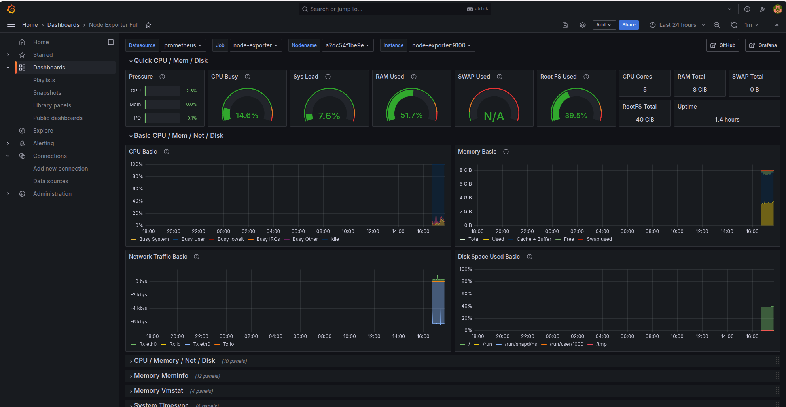

# 🚀 Production-Ready Linux Monitoring Stack

Ein leichtgewichtiges, containerisiertes Monitoring-System zur Echtzeit-Überwachung von Linux-Servern basierend auf **Prometheus**, **Grafana** und **Node Exporter**.

Dieses Projekt demonstriert Best Practices für moderne IT-Infrastrukturen: strikte Geheimhaltung von Secrets, präzise Versionierung von Docker-Images und automatisierte Konfigurationsprüfungen mittels GitHub Actions.

---

## 🏗️ Architektur & Funktionsweise

Das Monitoring nutzt das **Pull-Prinzip**:

1. **Node Exporter** liest Systemmetriken (CPU, RAM, Disk I/O, Network) direkt aus den Kernel-Dateisystemen (`/proc` & `/sys`) aus.
2. **Prometheus** scrapt (pullt) diese Daten alle 15 Sekunden und speichert sie zeitstempelseitig in einer Zeitreihendatenbank (TSDB).
3. **Grafana** visualisiert die gesammelten Metriken auf übersichtlichen, interaktiven Dashboards.

[ Linux Host ] ---> ( /proc & /sys )
|
[ Node Exporter ] (Port 9100)
^
| (Pull / 15s)
[ Prometheus TSDB ] (Port 9090)
^
| (Query / PromQL)
[ Grafana ] (Port 3000)




---

## ✨ Features & Standards

* **🛡️ Security & Secrets:** Keine Passwörter im Code. Konfiguration erfolgt sicher über eine `.env`-Datei.
* **🏷️ Explicit Pinning:** Keine unvorhersehbaren `:latest`-Tags – alle Container nutzen feste Release-Versionen.
* **⚡ Continuous Integration:** GitHub Actions prüft bei jedem Push automatisch die YAML-Syntax (`yamllint`) und die logische Korrektheit der Prometheus-Config (`promtool`).
* **💾 Persistent Storage:** Sämtliche Metriken und Dashboard-Einstellungen bleiben dank Docker Named Volumes bei Container-Neustarts vollständig erhalten.

---

## 🛠️ Tech Stack

* **Infrastructure:** Docker, Docker Compose
* **Monitoring & Metrics:** Prometheus, Prometheus Node Exporter
* **Visualization:** Grafana
* **CI/CD & Automation:** GitHub Actions (`yamllint`, `promtool`)
* **OS / Environment:** Ubuntu Linux

---

## 🚀 Schnelleinrichtung (Quickstart)

### 1. Repository klonen & Umgebung einrichten
```bash
git clone [https://github.com/DEIN_GITHUB_NAME/linux-monitoring-stack.git](https://github.com/DEIN_GITHUB_NAME/linux-monitoring-stack.git)
cd linux-monitoring-stack
cp .env.example .env
```

### 2. Zugangsdaten anpassen
Passe die Grafana-Admin-Zugangsdaten in der `.env`-Datei an:
```bash
GRAFANA_ADMIN_USER=admin
GRAFANA_ADMIN_PASSWORD=SicheresPasswort123!
```

### 3. Stack starten
```bash
docker compose up -d
```
Nach wenigen Sekunden stehen folgende Dienste bereit:
- Grafana: `http://localhost:3000`
- Prometheus: `http://localhost:9090`
- Node Exporter: `http://localhost:9100`

## 📊 CI/CD Pipeline Status
Die Pipeline stellt sicher, dass fehlerhafte Konfigurationen gar nicht erst auf den Server gelangen:
```bash
Push -> Actions Triggered -> Yamllint -> Promtool Config Check -> Green Build 🟢
```

---

## 🧪 Installation & Schnelltest (Quickstart)

In nur 3 Schritten ist der gesamte Monitoring-Stack einsatzbereit und testbar:

### 1. Repository klonen & Umgebung einrichten
```bash
git clone [https://github.com/DEIN_GITHUB_NAME/linux-monitoring-stack.git](https://github.com/DEIN_GITHUB_NAME/linux-monitoring-stack.git)
cd linux-monitoring-stack
cp .env.example .env
```

### 2. Stack starten
```bash
docker compose up -d
```
Prüfe den Status der Container:
```bash
docker ps
```
(Alle 3 Container prometheus, node-exporter und grafana sollten den Status Up anzeigen.)


## 🔍 Den Monitoring-Stack testen
### A. Grafana Dashboard aufrufen
1.  Öffne im Browser: `http://localhost:3000`
2. Melde dich mit den Zugangsdaten aus deiner `.env`-Datei an (Standard: `admin` / `SicheresPasswort123!`).
3. Unter Dashboards findest du das importierte Node Exporter Full Dashboard mit Live-Metriken deines Systems.

### B. Prometheus Targets & Endpunkte prüfen
- Prometheus UI: `http://localhost:9090`
(Unter `Status` -> `Targets` siehst du, dass beide Jobs `prometheus` und `node-exporter` den Status UP haben.)
- Node Exporter Rohe Metriken: `http://localhost:9100/metrics`
(Hier stellt der Node Exporter die rohen Hardware-Kennzahlen für Prometheus bereit.)

### C. Live-Stresstest durchführen (optional)
Um zu sehen, wie die Grafiken in Grafana in Echtzeit reagieren, kannst du die CPU der VM kurz belasten:
```bash
# Erzeugt für 30 Sekunden CPU-Last
stress-ng --cpu 2 --timeout 30s
# Alternativ (falls stress-ng nicht installiert ist):
dd if=/dev/zero of=/dev/null bs=1M count=100000
```
👉 Beobachte in Grafana, wie der CPU Usage Graph sofort nach oben ausschlägt! WOW!!!


## 🧹 Aufräumen / Stoppen
Um den Stack zu stoppen und die Volumes sauber zu entfernen:
```bash
docker compose down -v
```

## 👤 Autor
Entwickelt als praxiserprobtes Projekt im Bereich Systemadministration & DevOps.

## 💬 Persönlichen Worte
Dieses Projekt dient lediglich dazu, dass ich in die Welt des Systemadministrators eintauchen. Dieser Bereich gefällt mir sehr und zeigt auch als Entwickler wie interessant diese Welt sein kann. Es werden natürlich weitere Projekte kommen auch als Systemadministrator, auch größere und natürlich als Programmierer. Vielleicht sogar ein Projekt indem ich einen KI-Agenten entwickle, der ein paar Aufgaben als Systemadministrator automatisiert?
